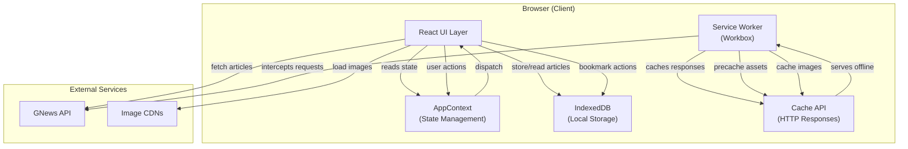
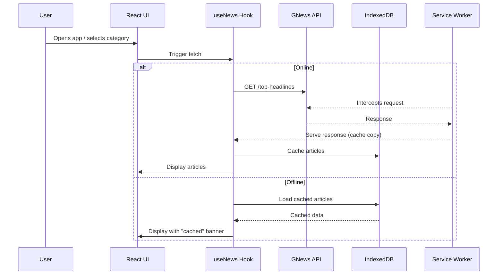
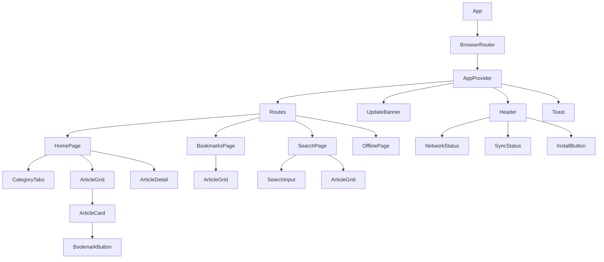

# Architecture Overview

How NewsWave is structured and how data flows through the app.

## High-Level Architecture

## Data Flow

## Component Tree

## State Management

The app uses React Context (`AppContext`) as a centralized store:

| State Key | Type | Purpose |
|-----------|------|---------|
| `isOnline` | boolean | Current network status |
| `syncStatus` | string | `idle` / `syncing` / `synced` / `error` |
| `pendingSyncCount` | number | Queued offline actions count |
| `showSyncToast` | boolean | Controls toast visibility |
| `showUpdateBanner` | boolean | New SW version available |

## Storage Strategy

| Store | Engine | Data |
|-------|--------|------|
| Articles | IndexedDB | Cached news articles by category |
| Bookmarks | IndexedDB | User-saved articles with timestamps |
| Sync Queue | IndexedDB | Pending offline actions (bookmark add/remove) |
| Settings | IndexedDB | User preferences |
| HTTP Cache | Cache API | API responses, fonts, images (via Service Worker) |

## Key Design Decisions

1. **Offline-first** — The UI assumes no network. Data loads from cache first, then refreshes.
2. **Separation of concerns** — Service Worker handles caching; React handles UI state.
3. **Graceful degradation** — Demo data when API key is missing; cached data when offline.
4. **No framework lock-in for SW** — Workbox configuration in `vite.config.js` generates the service worker at build time.
