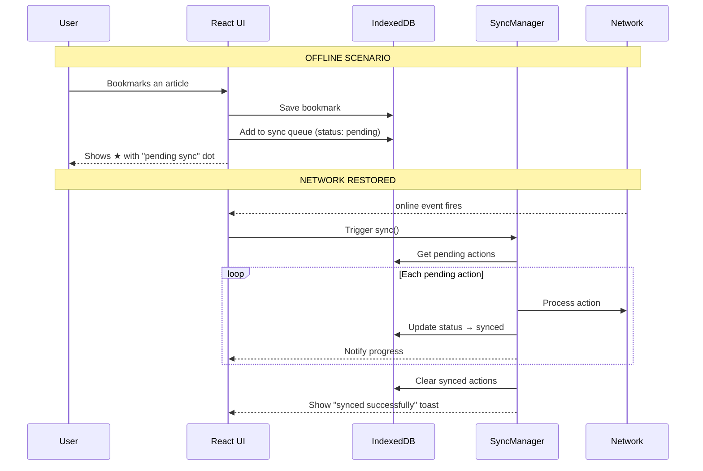

# Offline Sync

How NewsWave handles offline actions and syncs them when connectivity returns.

## The Problem

Users should be able to bookmark articles even when offline. Those actions need to persist and sync later.

## How It Works



## Sync Queue Schema

Each offline action is stored in IndexedDB's `sync-queue` store:

```json
{
  "id": 1,
  "type": "ADD_BOOKMARK",
  "data": {
    "url": "https://example.com/article",
    "title": "Article Title"
  },
  "status": "pending",
  "createdAt": 1710892800000
}
```

**Status values:** `pending` → `synced` or `failed`

## SyncManager Class

Located in `src/utils/syncManager.js`. It's a singleton that:

1. **Listens** for `online` events via AppContext
2. **Processes** queued actions sequentially
3. **Updates** each action's status in IndexedDB
4. **Notifies** the UI via a listener pattern
5. **Supports** Background Sync API where available

## UI Feedback

The sync state is communicated through multiple UI elements:

| Element | Location | Shows |
|---------|----------|-------|
| Sync Badge | Header | Pending count / syncing spinner / ✓ synced |
| Bookmark dot | Article card | Orange dot when pending sync |
| Toast | Bottom center | "X actions synced successfully" |
| Network pill | Header | Online (green) / Offline (red) |

## Background Sync API

When available, the app registers a Background Sync tag:

```js
registration.sync.register('sync-bookmarks');
```

This tells the browser to wake the service worker and retry sync even if the app is closed. Falls back to manual sync on `online` event if Background Sync is not supported.

## Edge Cases

- **Multiple offline bookmarks** — All queued and processed in order
- **Bookmark then unbookmark offline** — Both actions added to queue
- **Sync fails** — Action status set to `failed`, kept for retry
- **App closed while offline** — Background Sync handles it (if supported)
