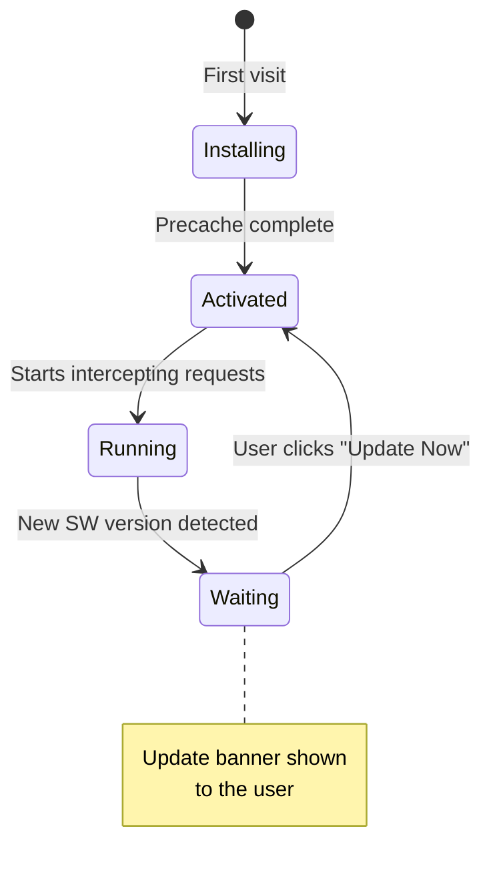
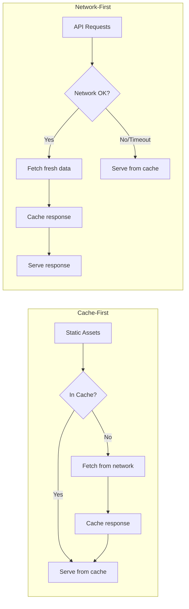

# PWA Setup Guide

Everything about the service worker, manifest, and caching in NewsWave.

## Web App Manifest

The manifest is configured in `vite.config.js` via `vite-plugin-pwa`:

| Field | Value |
|-------|-------|
| `name` | NewsWave - Smart News Reader |
| `short_name` | NewsWave |
| `display` | standalone |
| `start_url` | / |
| `theme_color` | #0a0e1a |
| `background_color` | #0a0e1a |
| Icons | 192×192 and 512×512 (regular + maskable) |

This enables:
- "Add to Home Screen" prompt on supported browsers
- Custom splash screen on app launch
- Standalone window (no browser chrome)

## Service Worker Lifecycle

The app handles the update flow by:
1. Detecting a new SW version via `workbox-window`
2. Showing an update banner in the UI
3. Sending `SKIP_WAITING` message on user confirmation
4. Reloading the page to activate the new SW

## Caching Strategies

| Asset Type | Strategy | Cache Name | Max Age |
|-----------|----------|------------|---------|
| JS, CSS, HTML | Cache-First (precache) | workbox-precache | Until next build |
| GNews API calls | Network-First | gnews-api-cache | 24 hours |
| Google Fonts CSS | Cache-First | google-fonts-cache | 1 year |
| Google Fonts files | Cache-First | gstatic-fonts-cache | 1 year |
| Images (jpg, png, etc.) | Cache-First | images-cache | 30 days |

## Precaching

Workbox automatically precaches all build output:
- `**/*.{js,css,html,ico,png,svg,woff2}`

This means the app shell loads instantly on repeat visits, even offline.

## Testing PWA Features

### Simulate Offline
1. Open Chrome DevTools → **Application** tab
2. Check **Offline** under "Service Workers"
3. Reload — cached pages should still work
4. Try navigating to the Home/Bookmarks pages

### Install the App
1. Build for production: `npm run build`
2. Preview: `npm run preview`
3. Look for the install icon in the browser address bar
4. Or click the "Install" button in the header

### Run Lighthouse Audit
1. Build and preview the production version
2. Open DevTools → **Lighthouse** tab
3. Select "Progressive Web App" category
4. Run the audit — target score: 90+

## File Reference

| File | Purpose |
|------|---------|
| `vite.config.js` | PWA plugin config, manifest, caching rules |
| `src/main.jsx` | Service worker registration via workbox-window |
| `src/components/UpdateBanner.jsx` | SW update UI |
| `src/components/InstallButton.jsx` | PWA install prompt |
| `public/icon-*.png` | App icons for manifest |
